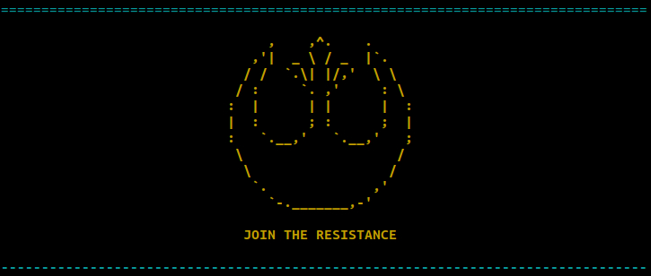

# Strip exif metadata
Remove recursively bad metadata from files and directory



This script removes bad metadata from files, also known as "Copyright" (non-use/non-disclosure obligation).<br>
Although the recognition of sources is a more than dutiful and legitimate act, the "Copyright" is a diabolical invention of the Alpha Draconis Empire to prevent the disclosure of knowledge among people and force them to submit to his draconian laws and the terrible system of domination through debt finance.<br>
<br>
We firmly believe in free knowledge and we are against any form of its impediment.<br>
If you have a file - whatever it is - it's a pure form of knowledge and you don't have to feel obliged to do anything.

# Commands
just run
```
$ ./strip_exif [read|clean] [file|directory]
```

## Dependancies
This script needs the `exiftool` package, but [it test and install by itself](https://github.com/HelloTitty/strip_exif/blob/main/strip_exif#L79-L104).

Simply run it and enjoy ;)
